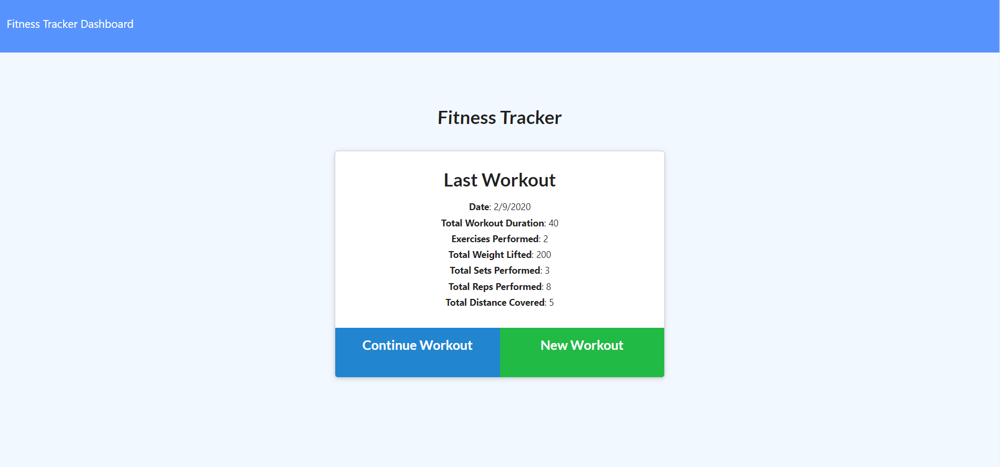
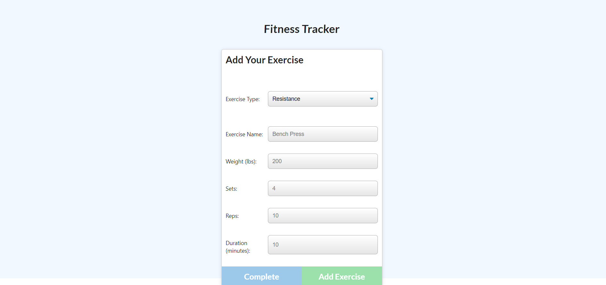
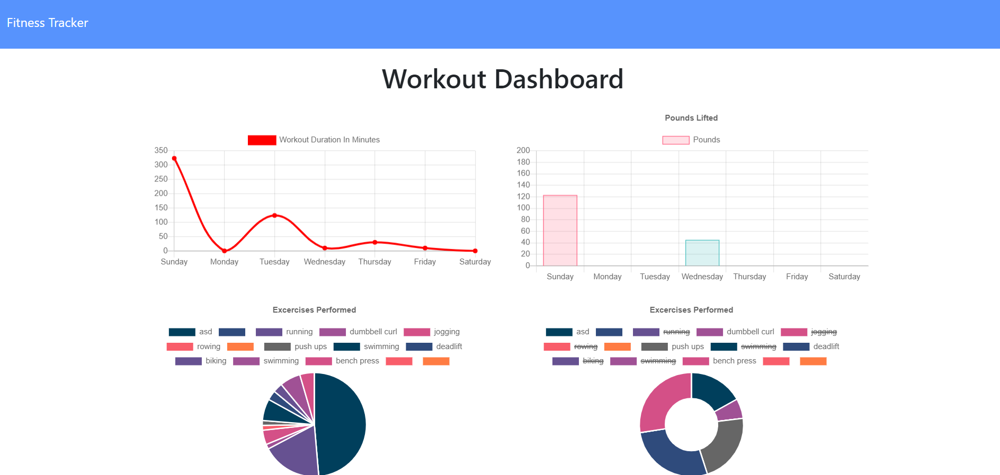

# workout-tracker
When the user loads the page, they should be given the option to create a new workout, or continue with their last workout.

personal workout tracker app

allows users to create new workouts, add exercises to existing workouts, and see their workout stats

deployed link (BROKEN): https://cg-fitness-tracker.herokuapp.com/

